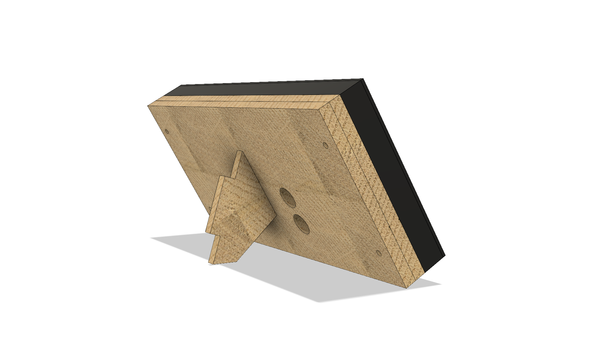
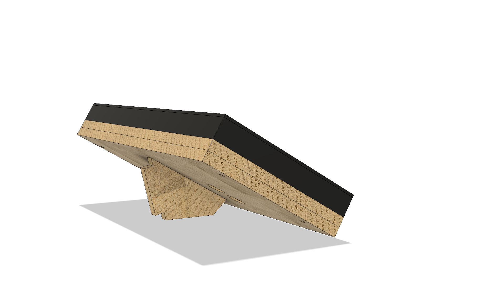
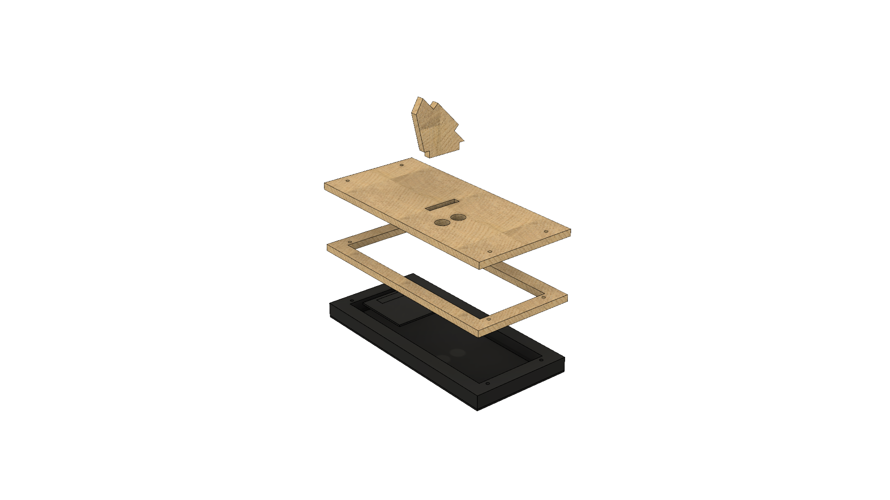

# Design purpose

Basic case for enclosing 192x96mm RGB matrix display. It's main purposes are:
 - enclose all electronics and cables inside
 - stand at desk with angle allowing user to easily read the display

Two holes are for power socket and for putting USB cable through (there is no nice enclosure-mountable micro usb with current PCB design - maybe in future).

Feet is dual angle - it allows to put it in slot two ways.

# Images
Standing at 60 degrees:

Standing at 30 degrees:

Disasembled view:

# Available files
Design created in Fusion 360, model can be found at:
 - backup file: [Model file](./case.f3d)
 - cloud link: [Model cloud](https://a360.co/2QW7WT2)

Almost production files (not including kerf) can be found at [Folder with dxfs](./dxfxs).

